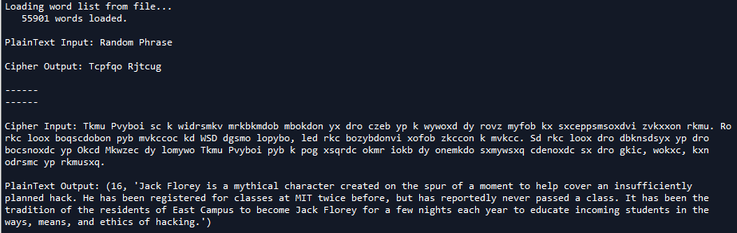

# CaesarCipherPlus
An upgrade on the traditional implementation of Caesar's cipher problem in Python

Traditional Caesar's cipher works in 2 ways:
  - Receive an encrypted input and a shift key and the program produces a decrypted output (plaintext)
  - Receive a decrypted output and shift key and the program produces an encrypted output (ciphertext)
  
CaesarCipherPlus:
  - Utilizes OOP instead of the traditional method of encrypting/decrypting ciphers allowing us to input multiple messages and create multiple individual objects
  - Program does not require a shift key to decrypt a message. This is more realistic since chances are that a user might not be given a shift key along with the encrypted message (kind of defeats the point of the encryption)

**Problem found on MIT OCW*
